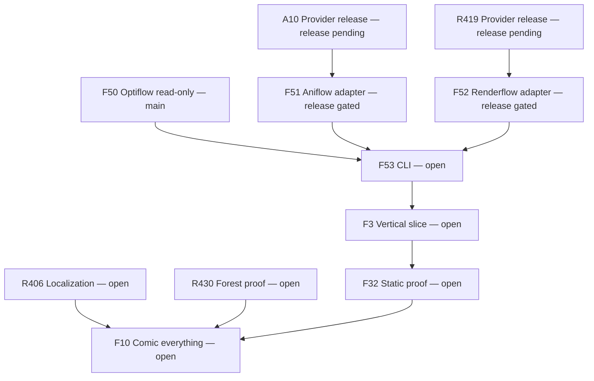
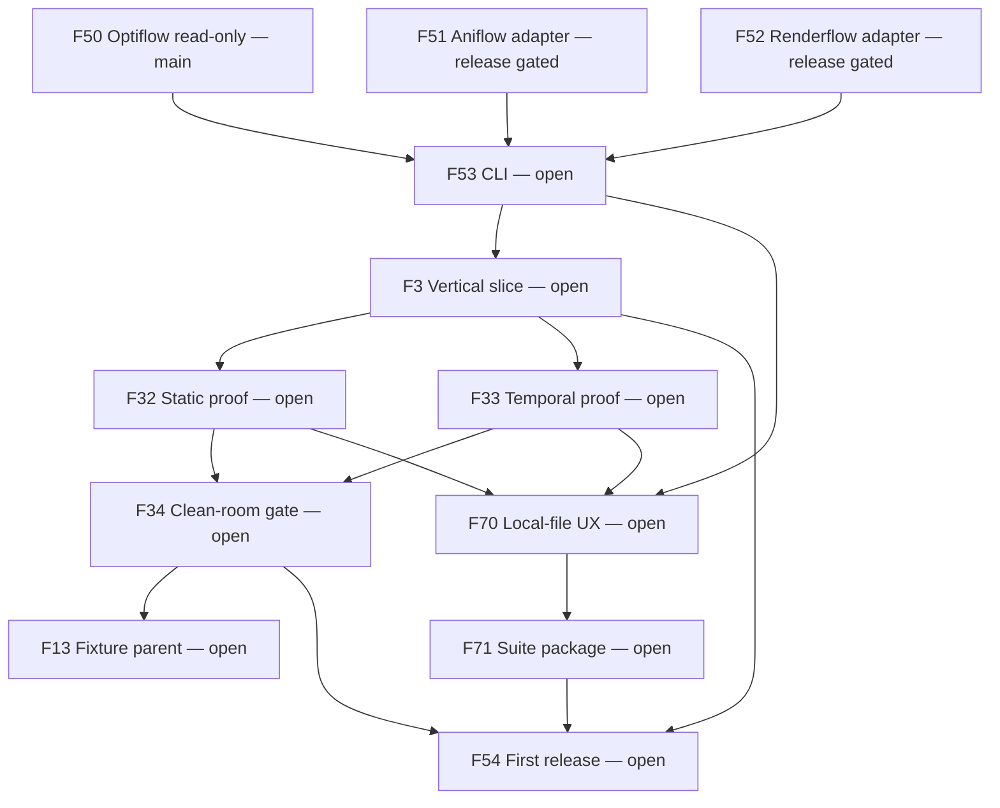
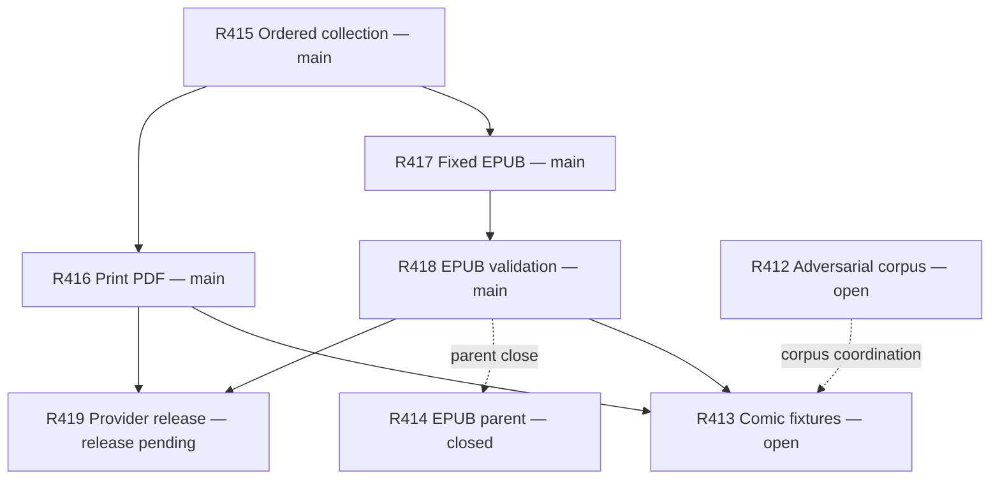
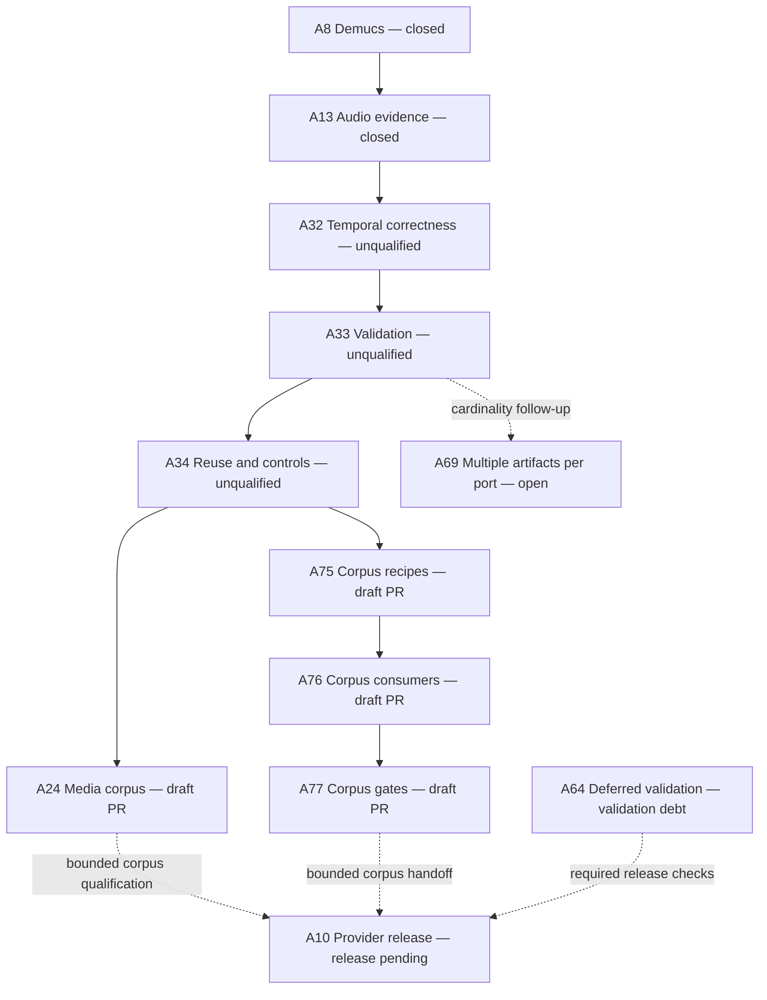
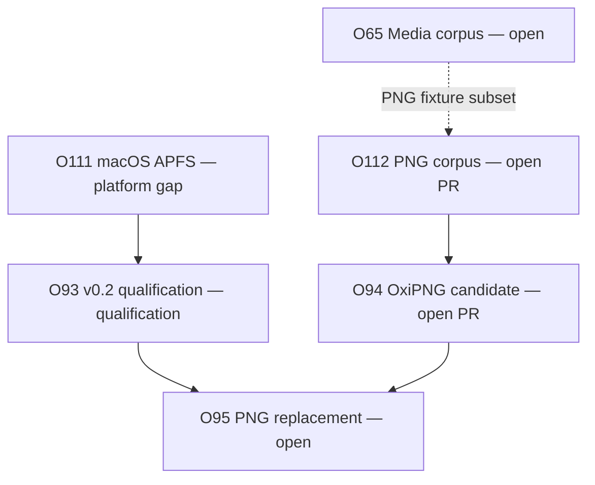
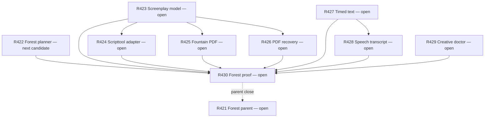
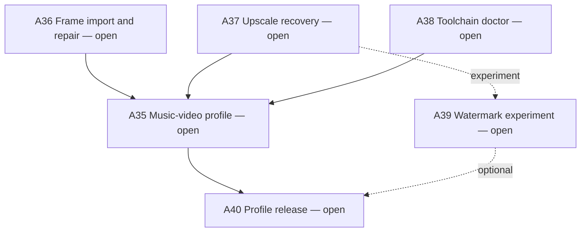
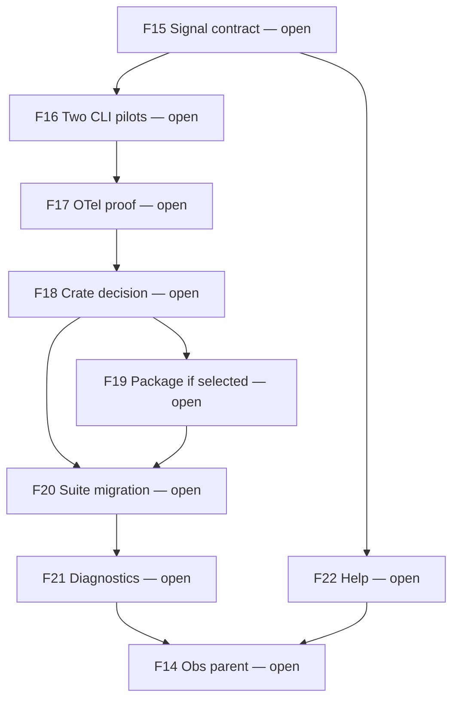
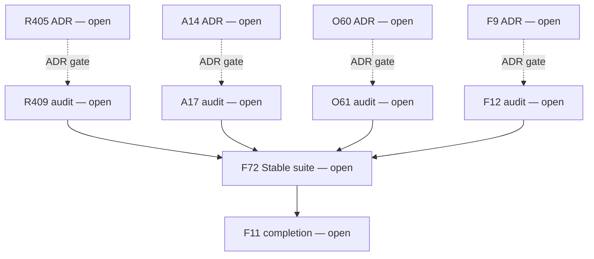

# Flow suite dependency map

The consumer outcome is a complete, inspectable comic artifact tree: each
requested branch identifies a produced artifact and its lineage/validation,
or an explicit unavailable, blocked, skipped, failed or awaiting-review state.
Creative approval and publication remain owned by the consumer.

This is the maintained dependency and evidence view for
[Flow #11](https://github.com/egohygiene/flow/issues/11).
[ROADMAP.md](../../ROADMAP.md) owns strategic horizons; individual issues own
acceptance and completion. This map does not grant execution, merge, CI,
real-media, provider-spending or publication authority.

## Provenance and observation

- Observed live at **2026-10-02T15:16:39.663Z** (October 2, 2026, America/New_York).
- Recovered source: [September 27 holistic map](https://github.com/egohygiene/flow/issues/11#issuecomment-5856716651).
- [Original Mermaid source](archive/flow-suite-dependencies-2026-09-27.mmd)
  preserves its fenced block verbatim: **80 nodes, 118 relationships**.
- Archive SHA-256: `e6697b351459e28f6466cd5fe63ed5081a1814a65cbde6f8fb962be7846f0e5d`.
- The attachment binary was unavailable; this capture preserves the public
  Mermaid source, not an independently compared or archived image.
- The current views retain every original issue and add seven newer open
  checkpoints: **87 issue nodes**, including all **76 currently open issues**.
- Each repository's open-issue endpoint returned fewer than the requested 100
  entries; all seven open PRs were included. Closed original nodes were checked
  individually. This is an inventory and bounded reconciliation, not a new audit.

| Repository | Observed main | Open issues | Open PRs | Published releases |
| --- | --- | ---: | ---: | --- |
| flow | [`2102c3d48998d6fa00da3751e2ae409dfa8b6d6c`](https://github.com/egohygiene/flow/commit/2102c3d48998d6fa00da3751e2ae409dfa8b6d6c) | 29 | 0 | None observed |
| renderflow | [`8e866f91aa8b20255f25a553031f25fa98aa3856`](https://github.com/egohygiene/renderflow/commit/8e866f91aa8b20255f25a553031f25fa98aa3856) | 23 | 0 | None observed |
| optiflow | [`67439404c5b98da72d48d50c08c826dc99d0678c`](https://github.com/egohygiene/optiflow/commit/67439404c5b98da72d48d50c08c826dc99d0678c) | 9 | 6 | Read-only v0.1.1 (latest); historical v0.1.0 |
| aniflow | [`48ea034897d27438fbec526e01d7e65a98104955`](https://github.com/egohygiene/aniflow/commit/48ea034897d27438fbec526e01d7e65a98104955) | 15 | 1 | None observed |

## Read the map

Stable prefixes are **F** = Flow, **R** = Renderflow, **O** = Optiflow and
**A** = Aniflow. Numbers are issue numbers in that repository, never PR numbers.
Solid arrows are required sequencing. Dotted arrows retain their explicit
meaning: a bounded fixture subset, coordination, optional capability, parent
reconciliation or scope decision. A dotted edge does not require its entire
upstream parent to close.

Node labels separate `main`, `closed`, `open PR`, `draft PR`, `unqualified`,
`release pending` and open work. Closed or merged does not mean independently
qualified, released or suitable for real-media mutation. The tables below
preserve every current relationship, including links between diagram views.
Diagrams are editable Mermaid source; no image is the canonical current map.

## Current reconciliation

- Flow's read-only Optiflow adapter is on main through
  [PR #76](https://github.com/egohygiene/flow/pull/76). Durable orchestration is
  implemented, while the public CLI and remaining released-provider adapters
  are still open. [Exact-main CI](https://github.com/egohygiene/flow/actions/runs/36341434892) succeeded.
- Renderflow's ordered collection, print PDF, fixed-layout EPUB and EPUB
  validation are merged. [PR #437](https://github.com/egohygiene/renderflow/pull/437)
  prepared the release, but #419 remains open and no release exists.
  [CI](https://github.com/egohygiene/renderflow/actions/runs/36454584953) failed;
  the earlier bounded job inspection located the installer smoke failure while
  build/tests passed. Docs and scheduled conformance have successful runs at
  the observed main. These do not satisfy the release gates by themselves.
- Optiflow [PR #114](https://github.com/egohygiene/optiflow/pull/114) merged into
  the branch of still-open [PR #113](https://github.com/egohygiene/optiflow/pull/113),
  not main. The latter now includes #112 fixtures and #94 candidate production;
  its description still primarily describes the fixture tranche. Its head is
  `2352a6f38bab4d9ec6f4490a2b9bf1824844c24f`. Local receipts have bounded scope;
  real OxiPNG, MSRV and native macOS qualification remain unproven. Main's
  [CI](https://github.com/egohygiene/optiflow/actions/runs/36316125329) succeeded.
  #111/#93 still gate a public mutation release; v0.1.1 remains read-only.
- Aniflow #32/#33/#34 are merged implementation with qualification deferred
  under [#64](https://github.com/egohygiene/aniflow/issues/64).
  [Current-main CI](https://github.com/egohygiene/aniflow/actions/runs/37001171820)
  fails; the earlier job inspection found all three compilation-check jobs and
  formatting failed. This is additional to the historical alignment cancellation
  failure, not a diagnosis of the same cause.
  [Draft PR #78](https://github.com/egohygiene/aniflow/pull/78), head
  `06d92de6741e869a59ca9e41d9c76dea4b644606`, contains #75–#77's bounded corpus
  implementation. Its tests/checks are unrun; #24 stays open for broader coverage.
- Optiflow #116–#120 are five dependency PRs, not additional product milestones.
  They are recorded as parallel maintenance and are not merged by this map update.
- None of the four inspected main trees has root `CONTINUITY.md`. Current
  recovery sources are roadmap handoffs and repository-specific work receipts.
  This capture's [handoff](../work/11/HANDOFF.md) preserves its own resume point.

## Relationship corrections from the archived map

| Historical relationship | Current reading and source |
| --- | --- |
| R422 required before R423 | Removed. [R421](https://github.com/egohygiene/renderflow/issues/421) explicitly permits #422, #423 and #427 to start independently. |
| R419 and all of R412 required before R413 | The initial local comic pack consumes the implemented PDF/EPUB routes (R416/R418). R412 is corpus coordination; the pack does not need a published release to be authored. [R413](https://github.com/egohygiene/renderflow/issues/413) owns that scope. Released-provider proof remains F32. |
| All of A24 must close before A10 | The [current handoff](https://github.com/egohygiene/flow/issues/11#issuecomment-5953882829) calls for bounded corpus completion/qualification, while the broad corpus parent stays open. A75–A77 and the required subset of A64 are now visible. |
| O65 fixture subset directly feeds O94 | The existing [O112](https://github.com/egohygiene/optiflow/issues/112) checkpoint identifies that subset explicitly; its implementation and O94 are awaiting PR #113 review. |

Other inherited relationships retain the original map's scope and provenance.
They are not a claim that every issue's external dependencies were re-audited.
In particular Aniflow #10 and Optiflow #115 have external release-policy gates
whose current states must be checked when selecting those checkpoints.

## Recommended near-term sequence

1. Preserve and review the existing PRs and their evidence; do not reimplement
   Aniflow #75–#77 or Optiflow #112/#94. Review and merge remain human decisions.
2. Select one small implementation checkpoint under R422 for the comic tree:
   deduplicate repeated target requests while preserving distinct supported
   roles. Existing all-reachable planning and source exclusion are foundations
   to extend, not features to recreate. This remains a proposal, not work started.
3. Finish that one parent batch, then loop back for its named tests, docs, local
   CI and boundary audit before another consumer relies on the changed planner.
4. Prove a small synthetic comic tree through R413; select localization R406 and
   additional R421 families in separate bounded batches. Provider release
   qualification and Flow adapters/CLI/static proof converge on F10.

The near-term comic outcome does not require every optional product, telemetry,
HTTP, music-video or mutation lane to ship first. Original issue acceptance is
preserved; proposed scheduling is not a revision of release requirements.

## Focused diagram views

These views show internal lane relationships. The issue/relationship inventory
following them includes all cross-lane dependencies and optional connections.

### Comic path across repositories

### Flow first install

### Renderflow publication

### Aniflow implementation and qualification

### Optiflow upgrades

### Creative derivative forest

### Aniflow music video

### Flow observability

### Governance and finish

## Complete issue and relationship inventory

Each issue appears once below. Required successors and scoped relationships
are the maintained edge list; labels such as `scope` and `optional` must not
be promoted into unconditional blockers. Implementation, verification and
release evidence stay separate from GitHub's open/closed field.

### Flow first install

| Issue | Observed state and remaining work | Required successors | Scoped relationships |
| --- | --- | --- | --- |
| [F50](https://github.com/egohygiene/flow/issues/50) — Optiflow read-only | **closed**. Merged on main; read-only Optiflow v0.1.1 adapter (PR #76). | [F53](https://github.com/egohygiene/flow/issues/53), [F73](https://github.com/egohygiene/flow/issues/73) | — |
| [F51](https://github.com/egohygiene/flow/issues/51) — Aniflow adapter | **open**. Awaiting an immutable qualified Aniflow release. | [F53](https://github.com/egohygiene/flow/issues/53), [F75](https://github.com/egohygiene/flow/issues/75) | — |
| [F52](https://github.com/egohygiene/flow/issues/52) — Renderflow adapter | **open**. Awaiting an immutable qualified Renderflow release. | [F53](https://github.com/egohygiene/flow/issues/53) | — |
| [F53](https://github.com/egohygiene/flow/issues/53) — CLI | **open**. Open; outstanding acceptance remains in the linked issue. | [F3](https://github.com/egohygiene/flow/issues/3), [F70](https://github.com/egohygiene/flow/issues/70) | — |
| [F3](https://github.com/egohygiene/flow/issues/3) — Vertical slice | **open**. Open; outstanding acceptance remains in the linked issue. | [F32](https://github.com/egohygiene/flow/issues/32), [F33](https://github.com/egohygiene/flow/issues/33), [F54](https://github.com/egohygiene/flow/issues/54) | — |
| [F32](https://github.com/egohygiene/flow/issues/32) — Static proof | **open**. Open; outstanding acceptance remains in the linked issue. | [F34](https://github.com/egohygiene/flow/issues/34), [F70](https://github.com/egohygiene/flow/issues/70), [F10](https://github.com/egohygiene/flow/issues/10) | — |
| [F33](https://github.com/egohygiene/flow/issues/33) — Temporal proof | **open**. Open; outstanding acceptance remains in the linked issue. | [F34](https://github.com/egohygiene/flow/issues/34), [F70](https://github.com/egohygiene/flow/issues/70) | — |
| [F34](https://github.com/egohygiene/flow/issues/34) — Clean-room gate | **open**. Open; outstanding acceptance remains in the linked issue. | [F13](https://github.com/egohygiene/flow/issues/13), [F54](https://github.com/egohygiene/flow/issues/54) | [F62](https://github.com/egohygiene/flow/issues/62): docs |
| [F13](https://github.com/egohygiene/flow/issues/13) — Fixture parent | **open**. Open; outstanding acceptance remains in the linked issue. | [F12](https://github.com/egohygiene/flow/issues/12) | — |
| [F70](https://github.com/egohygiene/flow/issues/70) — Local-file UX | **open**. Open; outstanding acceptance remains in the linked issue. | [F71](https://github.com/egohygiene/flow/issues/71) | — |
| [F71](https://github.com/egohygiene/flow/issues/71) — Suite package | **open**. Open; outstanding acceptance remains in the linked issue. | [F54](https://github.com/egohygiene/flow/issues/54) | — |
| [F54](https://github.com/egohygiene/flow/issues/54) — First release | **open**. Open; outstanding acceptance remains in the linked issue. | [F12](https://github.com/egohygiene/flow/issues/12), [F72](https://github.com/egohygiene/flow/issues/72) | — |

### Renderflow publication

| Issue | Observed state and remaining work | Required successors | Scoped relationships |
| --- | --- | --- | --- |
| [R414](https://github.com/egohygiene/renderflow/issues/414) — EPUB parent | **closed**. Closed publication parent; bounded PDF/EPUB scope, not retailer or release approval. | — | — |
| [R415](https://github.com/egohygiene/renderflow/issues/415) — Ordered collection | **closed**. Merged ordered-collection implementation. | [R416](https://github.com/egohygiene/renderflow/issues/416), [R417](https://github.com/egohygiene/renderflow/issues/417) | — |
| [R416](https://github.com/egohygiene/renderflow/issues/416) — Print PDF | **closed**. Merged bounded print-interior PDF route. | [R419](https://github.com/egohygiene/renderflow/issues/419), [R413](https://github.com/egohygiene/renderflow/issues/413) | — |
| [R417](https://github.com/egohygiene/renderflow/issues/417) — Fixed EPUB | **closed**. Merged bounded fixed-layout EPUB route. | [R418](https://github.com/egohygiene/renderflow/issues/418) | — |
| [R418](https://github.com/egohygiene/renderflow/issues/418) — EPUB validation | **closed**. Merged EPUB validation and capability evidence. | [R419](https://github.com/egohygiene/renderflow/issues/419), [R413](https://github.com/egohygiene/renderflow/issues/413) | [R414](https://github.com/egohygiene/renderflow/issues/414): parent close |
| [R419](https://github.com/egohygiene/renderflow/issues/419) — Provider release | **open**. Release preparation merged (PR #437); no published release; CI installer failure remains. | [F52](https://github.com/egohygiene/flow/issues/52), [R409](https://github.com/egohygiene/renderflow/issues/409) | — |
| [R412](https://github.com/egohygiene/renderflow/issues/412) — Adversarial corpus | **open**. Open; outstanding acceptance remains in the linked issue. | — | [F33](https://github.com/egohygiene/flow/issues/33): fixture subset; [R413](https://github.com/egohygiene/renderflow/issues/413): corpus coordination |
| [R413](https://github.com/egohygiene/renderflow/issues/413) — Comic fixtures | **open**. Open; outstanding acceptance remains in the linked issue. | — | [F32](https://github.com/egohygiene/flow/issues/32): fixture subset |

### Aniflow first release

| Issue | Observed state and remaining work | Required successors | Scoped relationships |
| --- | --- | --- | --- |
| [A8](https://github.com/egohygiene/aniflow/issues/8) — Demucs | **closed**. Closed offline Demucs feature; native/model qualification remains scope-specific. | [A13](https://github.com/egohygiene/aniflow/issues/13) | — |
| [A13](https://github.com/egohygiene/aniflow/issues/13) — Audio evidence | **closed**. Closed bounded audio implementation; no Aniflow release is available. | [A32](https://github.com/egohygiene/aniflow/issues/32), [R397](https://github.com/egohygiene/renderflow/issues/397), [R349](https://github.com/egohygiene/renderflow/issues/349) | — |
| [A32](https://github.com/egohygiene/aniflow/issues/32) — Temporal correctness | **closed**. Merged implementation; qualification deferred under #64. | [A33](https://github.com/egohygiene/aniflow/issues/33) | — |
| [A33](https://github.com/egohygiene/aniflow/issues/33) — Validation | **closed**. Merged implementation; qualification deferred under #64; multi-artifact ports remain #69. | [A34](https://github.com/egohygiene/aniflow/issues/34), [A36](https://github.com/egohygiene/aniflow/issues/36), [A37](https://github.com/egohygiene/aniflow/issues/37) | [A69](https://github.com/egohygiene/aniflow/issues/69): cardinality follow-up |
| [A34](https://github.com/egohygiene/aniflow/issues/34) — Reuse and controls | **closed**. Merged implementation (PR #74); qualification deferred under #64. | [A24](https://github.com/egohygiene/aniflow/issues/24), [A75](https://github.com/egohygiene/aniflow/issues/75) | — |
| [A24](https://github.com/egohygiene/aniflow/issues/24) — Media corpus | **open**. Open corpus parent; bounded implementation in draft PR #78, checks unrun. | — | [F33](https://github.com/egohygiene/flow/issues/33): fixture subset; [A10](https://github.com/egohygiene/aniflow/issues/10): bounded corpus qualification |
| [A10](https://github.com/egohygiene/aniflow/issues/10) — Provider release | **open**. No published release; required qualification and external release-policy dependencies remain to be satisfied/rechecked. | [F51](https://github.com/egohygiene/flow/issues/51), [A40](https://github.com/egohygiene/aniflow/issues/40), [A17](https://github.com/egohygiene/aniflow/issues/17) | — |
| [A64](https://github.com/egohygiene/aniflow/issues/64) — Deferred validation | **open**. Open qualification debt; current main compilation-check and format jobs fail; earlier alignment failure remains historical evidence. | — | [A10](https://github.com/egohygiene/aniflow/issues/10): required release checks |
| [A69](https://github.com/egohygiene/aniflow/issues/69) — Multiple artifacts per port | **open**. Open follow-up; single-artifact-per-port profile remains the implemented boundary. | — | — |
| [A75](https://github.com/egohygiene/aniflow/issues/75) — Corpus recipes | **open**. Authored in draft PR #78; execution deferred under #64. | [A76](https://github.com/egohygiene/aniflow/issues/76) | — |
| [A76](https://github.com/egohygiene/aniflow/issues/76) — Corpus consumers | **open**. Authored in draft PR #78; execution deferred under #64. | [A77](https://github.com/egohygiene/aniflow/issues/77) | — |
| [A77](https://github.com/egohygiene/aniflow/issues/77) — Corpus gates | **open**. Authored in draft PR #78; execution deferred under #64. | — | [A10](https://github.com/egohygiene/aniflow/issues/10): bounded corpus handoff |

### Optiflow upgrades

| Issue | Observed state and remaining work | Required successors | Scoped relationships |
| --- | --- | --- | --- |
| [O111](https://github.com/egohygiene/optiflow/issues/111) — macOS APFS | **open**. macOS/APFS mutation implementation and native proof remain outstanding. | [O93](https://github.com/egohygiene/optiflow/issues/93) | — |
| [O93](https://github.com/egohygiene/optiflow/issues/93) — v0.2 qualification | **open**. Blocked on #111 and native/disposable-volume qualification; public v0.1.1 remains read-only. | [O95](https://github.com/egohygiene/optiflow/issues/95), [F73](https://github.com/egohygiene/flow/issues/73), [O61](https://github.com/egohygiene/optiflow/issues/61) | — |
| [O65](https://github.com/egohygiene/optiflow/issues/65) — Media corpus | **open**. Open; outstanding acceptance remains in the linked issue. | — | [F32](https://github.com/egohygiene/flow/issues/32): fixture subset; [O112](https://github.com/egohygiene/optiflow/issues/112): PNG fixture subset |
| [O94](https://github.com/egohygiene/optiflow/issues/94) — OxiPNG candidate | **open**. PR #114 merged into PR #113's branch, not main; real OxiPNG/MSRV/macOS qualification remains unproven. | [O95](https://github.com/egohygiene/optiflow/issues/95) | — |
| [O95](https://github.com/egohygiene/optiflow/issues/95) — PNG replacement | **open**. Open; outstanding acceptance remains in the linked issue. | [F74](https://github.com/egohygiene/flow/issues/74) | [O61](https://github.com/egohygiene/optiflow/issues/61): scope |
| [O112](https://github.com/egohygiene/optiflow/issues/112) — PNG corpus | **open**. Authored in open PR #113; not on main. PR reports scoped local evidence. | [O94](https://github.com/egohygiene/optiflow/issues/94) | — |
| [O115](https://github.com/egohygiene/optiflow/issues/115) — Release names | **open**. Open product-name adoption checkpoint; Relay dependency is external and unverified here. | — | — |

### Flow later capabilities

| Issue | Observed state and remaining work | Required successors | Scoped relationships |
| --- | --- | --- | --- |
| [F73](https://github.com/egohygiene/flow/issues/73) — Exact dedup adapter | **open**. Open; outstanding acceptance remains in the linked issue. | [F74](https://github.com/egohygiene/flow/issues/74) | [F11](https://github.com/egohygiene/flow/issues/11): later |
| [F74](https://github.com/egohygiene/flow/issues/74) — PNG adapter | **open**. Open; outstanding acceptance remains in the linked issue. | — | [F11](https://github.com/egohygiene/flow/issues/11): later |
| [F75](https://github.com/egohygiene/flow/issues/75) — Music-video adapter | **open**. Open; outstanding acceptance remains in the linked issue. | — | [F11](https://github.com/egohygiene/flow/issues/11): later |
| [F10](https://github.com/egohygiene/flow/issues/10) — Comic everything | **open**. Open; outstanding acceptance remains in the linked issue. | — | [F12](https://github.com/egohygiene/flow/issues/12): scope |
| [F62](https://github.com/egohygiene/flow/issues/62) — Scenario docs | **open**. Open; outstanding acceptance remains in the linked issue. | — | [F12](https://github.com/egohygiene/flow/issues/12): review |

### Aniflow music video

| Issue | Observed state and remaining work | Required successors | Scoped relationships |
| --- | --- | --- | --- |
| [A36](https://github.com/egohygiene/aniflow/issues/36) — Frame import and repair | **open**. Open; outstanding acceptance remains in the linked issue. | [A35](https://github.com/egohygiene/aniflow/issues/35) | — |
| [A37](https://github.com/egohygiene/aniflow/issues/37) — Upscale recovery | **open**. Open; outstanding acceptance remains in the linked issue. | [A35](https://github.com/egohygiene/aniflow/issues/35) | [A39](https://github.com/egohygiene/aniflow/issues/39): experiment |
| [A38](https://github.com/egohygiene/aniflow/issues/38) — Toolchain doctor | **open**. Open; outstanding acceptance remains in the linked issue. | [A35](https://github.com/egohygiene/aniflow/issues/35) | — |
| [A35](https://github.com/egohygiene/aniflow/issues/35) — Music-video profile | **open**. Open; outstanding acceptance remains in the linked issue. | [A40](https://github.com/egohygiene/aniflow/issues/40) | — |
| [A39](https://github.com/egohygiene/aniflow/issues/39) — Watermark experiment | **open**. Open; outstanding acceptance remains in the linked issue. | — | [A40](https://github.com/egohygiene/aniflow/issues/40): optional |
| [A40](https://github.com/egohygiene/aniflow/issues/40) — Profile release | **open**. Open; outstanding acceptance remains in the linked issue. | [F75](https://github.com/egohygiene/flow/issues/75) | [A17](https://github.com/egohygiene/aniflow/issues/17): scope |

### Renderflow broader product

| Issue | Observed state and remaining work | Required successors | Scoped relationships |
| --- | --- | --- | --- |
| [R406](https://github.com/egohygiene/renderflow/issues/406) — Localization | **open**. Open; outstanding acceptance remains in the linked issue. | [F10](https://github.com/egohygiene/flow/issues/10) | [R413](https://github.com/egohygiene/renderflow/issues/413): fixture subset |
| [R421](https://github.com/egohygiene/renderflow/issues/421) — Forest parent | **open**. Open; outstanding acceptance remains in the linked issue. | — | — |
| [R422](https://github.com/egohygiene/renderflow/issues/422) — Forest planner | **open**. Open; existing all-reachable/forest primitives need the remaining identity/cycle/fidelity contract and proof. | [R430](https://github.com/egohygiene/renderflow/issues/430) | — |
| [R423](https://github.com/egohygiene/renderflow/issues/423) — Screenplay model | **open**. Open; outstanding acceptance remains in the linked issue. | [R424](https://github.com/egohygiene/renderflow/issues/424), [R425](https://github.com/egohygiene/renderflow/issues/425), [R426](https://github.com/egohygiene/renderflow/issues/426), [R430](https://github.com/egohygiene/renderflow/issues/430) | — |
| [R424](https://github.com/egohygiene/renderflow/issues/424) — Scripttool adapter | **open**. Open; outstanding acceptance remains in the linked issue. | [R430](https://github.com/egohygiene/renderflow/issues/430) | — |
| [R425](https://github.com/egohygiene/renderflow/issues/425) — Fountain PDF | **open**. Open; outstanding acceptance remains in the linked issue. | [R430](https://github.com/egohygiene/renderflow/issues/430) | — |
| [R426](https://github.com/egohygiene/renderflow/issues/426) — PDF recovery | **open**. Open; outstanding acceptance remains in the linked issue. | [R430](https://github.com/egohygiene/renderflow/issues/430) | — |
| [R427](https://github.com/egohygiene/renderflow/issues/427) — Timed text | **open**. Open; outstanding acceptance remains in the linked issue. | [R428](https://github.com/egohygiene/renderflow/issues/428), [R430](https://github.com/egohygiene/renderflow/issues/430) | — |
| [R428](https://github.com/egohygiene/renderflow/issues/428) — Speech transcript | **open**. Open; outstanding acceptance remains in the linked issue. | [R430](https://github.com/egohygiene/renderflow/issues/430) | — |
| [R429](https://github.com/egohygiene/renderflow/issues/429) — Creative doctor | **open**. Open; outstanding acceptance remains in the linked issue. | [R430](https://github.com/egohygiene/renderflow/issues/430) | — |
| [R430](https://github.com/egohygiene/renderflow/issues/430) — Forest proof | **open**. Open; outstanding acceptance remains in the linked issue. | [F10](https://github.com/egohygiene/flow/issues/10) | [R421](https://github.com/egohygiene/renderflow/issues/421): parent close; [R367](https://github.com/egohygiene/renderflow/issues/367): reconcile |
| [R367](https://github.com/egohygiene/renderflow/issues/367) — Product roadmap | **open**. Open; outstanding acceptance remains in the linked issue. | — | [R409](https://github.com/egohygiene/renderflow/issues/409): scope |
| [R397](https://github.com/egohygiene/renderflow/issues/397) — Sonic DNA | **open**. Open; outstanding acceptance remains in the linked issue. | — | [R367](https://github.com/egohygiene/renderflow/issues/367): profile |
| [R378](https://github.com/egohygiene/renderflow/issues/378) — Article copilot | **open**. Open; outstanding acceptance remains in the linked issue. | [R379](https://github.com/egohygiene/renderflow/issues/379) | — |
| [R379](https://github.com/egohygiene/renderflow/issues/379) — Editorial profile | **open**. Open; outstanding acceptance remains in the linked issue. | — | [R367](https://github.com/egohygiene/renderflow/issues/367): profile |
| [R350](https://github.com/egohygiene/renderflow/issues/350) — Slides | **open**. Open; outstanding acceptance remains in the linked issue. | — | [R367](https://github.com/egohygiene/renderflow/issues/367): profile |
| [R349](https://github.com/egohygiene/renderflow/issues/349) — Podcast | **open**. Open; outstanding acceptance remains in the linked issue. | — | [R367](https://github.com/egohygiene/renderflow/issues/367): profile |
| [R420](https://github.com/egohygiene/renderflow/issues/420) — HTTP API | **open**. Open; outstanding acceptance remains in the linked issue. | — | [R367](https://github.com/egohygiene/renderflow/issues/367): optional |

### Flow observability

| Issue | Observed state and remaining work | Required successors | Scoped relationships |
| --- | --- | --- | --- |
| [F15](https://github.com/egohygiene/flow/issues/15) — Signal contract | **open**. Open; outstanding acceptance remains in the linked issue. | [F16](https://github.com/egohygiene/flow/issues/16), [F22](https://github.com/egohygiene/flow/issues/22) | — |
| [F16](https://github.com/egohygiene/flow/issues/16) — Two CLI pilots | **open**. Open; outstanding acceptance remains in the linked issue. | [F17](https://github.com/egohygiene/flow/issues/17) | — |
| [F17](https://github.com/egohygiene/flow/issues/17) — OTel proof | **open**. Open; outstanding acceptance remains in the linked issue. | [F18](https://github.com/egohygiene/flow/issues/18) | — |
| [F18](https://github.com/egohygiene/flow/issues/18) — Crate decision | **open**. Open; outstanding acceptance remains in the linked issue. | [F19](https://github.com/egohygiene/flow/issues/19), [F20](https://github.com/egohygiene/flow/issues/20) | — |
| [F19](https://github.com/egohygiene/flow/issues/19) — Package if selected | **open**. Open; outstanding acceptance remains in the linked issue. | [F20](https://github.com/egohygiene/flow/issues/20) | — |
| [F20](https://github.com/egohygiene/flow/issues/20) — Suite migration | **open**. Open; outstanding acceptance remains in the linked issue. | [F21](https://github.com/egohygiene/flow/issues/21) | — |
| [F21](https://github.com/egohygiene/flow/issues/21) — Diagnostics | **open**. Open; outstanding acceptance remains in the linked issue. | [F14](https://github.com/egohygiene/flow/issues/14) | — |
| [F22](https://github.com/egohygiene/flow/issues/22) — Help | **open**. Open; outstanding acceptance remains in the linked issue. | [F14](https://github.com/egohygiene/flow/issues/14) | — |
| [F14](https://github.com/egohygiene/flow/issues/14) — Obs parent | **open**. Open; outstanding acceptance remains in the linked issue. | — | [F54](https://github.com/egohygiene/flow/issues/54): disposition; [F12](https://github.com/egohygiene/flow/issues/12): scope |

### Governance and finish

| Issue | Observed state and remaining work | Required successors | Scoped relationships |
| --- | --- | --- | --- |
| [F9](https://github.com/egohygiene/flow/issues/9) — ADR | **open**. Open; outstanding acceptance remains in the linked issue. | — | [F12](https://github.com/egohygiene/flow/issues/12): ADR gate |
| [R405](https://github.com/egohygiene/renderflow/issues/405) — ADR | **open**. Open; outstanding acceptance remains in the linked issue. | — | [R409](https://github.com/egohygiene/renderflow/issues/409): ADR gate |
| [O60](https://github.com/egohygiene/optiflow/issues/60) — ADR | **open**. Open; outstanding acceptance remains in the linked issue. | — | [O61](https://github.com/egohygiene/optiflow/issues/61): ADR gate |
| [A14](https://github.com/egohygiene/aniflow/issues/14) — ADR | **open**. Open; outstanding acceptance remains in the linked issue. | — | [A17](https://github.com/egohygiene/aniflow/issues/17): ADR gate |
| [R409](https://github.com/egohygiene/renderflow/issues/409) — audit | **open**. Open; outstanding acceptance remains in the linked issue. | [F72](https://github.com/egohygiene/flow/issues/72) | — |
| [O61](https://github.com/egohygiene/optiflow/issues/61) — audit | **open**. Open; outstanding acceptance remains in the linked issue. | [F72](https://github.com/egohygiene/flow/issues/72) | — |
| [A17](https://github.com/egohygiene/aniflow/issues/17) — audit | **open**. Open; outstanding acceptance remains in the linked issue. | [F72](https://github.com/egohygiene/flow/issues/72) | — |
| [F12](https://github.com/egohygiene/flow/issues/12) — audit | **open**. Open; outstanding acceptance remains in the linked issue. | [F72](https://github.com/egohygiene/flow/issues/72) | — |
| [F72](https://github.com/egohygiene/flow/issues/72) — Stable suite | **open**. Open; outstanding acceptance remains in the linked issue. | [F11](https://github.com/egohygiene/flow/issues/11) | — |
| [F11](https://github.com/egohygiene/flow/issues/11) — completion | **open**. Open; outstanding acceptance remains in the linked issue. | — | — |

## Updating this map

1. Read live repository instructions and handoffs. Recheck main SHAs, open
   issues/PRs, the selected checkpoint's dependencies and relevant releases.
   Record observation time and any inventory cap or access limitation.
2. Reconcile PR base and head: merging into a feature branch is not merging
   into main. Verify actual artifacts before calling a release published.
3. Update the affected inventory rows and Mermaid views in this file together.
   Retain completed prerequisites as context. Add new checkpoint nodes only when
   supported by existing issues or newly authorized tracker work.
4. Distinguish authored, executed, passed, failed, blocked and deferred checks.
   Preserve original receipt scope and current failures; never recolor a merged
   implementation as qualified solely because its issue closed.
5. Explain changed edges with owner-source links. Keep required gates separate
   from optional capabilities, parent coordination and bounded fixture subsets.
   Do not import private consumer media, conversations or local machine paths.
6. Keep the archived September source unchanged. Future screenshots/exports are
   derivatives of the current Mermaid and must identify their source revision.
7. Update the sprint handoff, link the draft PR to #11, and stop at the selected
   checkpoint. This is manual maintenance; no scheduler or background sync exists.

## Deferred work and completion boundary

The selected workflow is [Aether worker-strategy v0.1.0](https://github.com/egohygiene/aether/blob/db5f4bd339f9266758c74c3435d47c8005f89a8e/library/organization/specs/methodology/worker-strategy.spec.md),
using its same-revision specfile, repository-continuity and local-validation
evidence dependencies. The implementation-first batch limit is one selected
parent issue, followed by its applicable completion passes.

| Obligation | Owner / loop-back trigger |
| --- | --- |
| #422 regression, cycle/identity/fidelity coverage and focused shared-interface integration | R422 handoff; before downstream reliance and parent closure |
| Documentation polish, native local CI commands, explicit environment gaps and changed-boundary audit | Same R422 completion pass; unrun work remains deferred |
| Current Renderflow installer/release failure, exact provider packages and downloaded-asset proof | R419; before release or F52 reliance |
| Aniflow compilation/format failures, historical alignment failure and #32–#34/#24 checks | A64; required subset before release, broader audit separately scoped |
| Optiflow PR #113 reconciliation, real-provider/platform proof and mutation qualification | O112/O94 and O111/O93; before the relevant consumer or release |
| Provider-wide and final suite audits | R409/O61/A17, then F12; stable suite F72 |
| Native Mermaid layout/render inspection and exact uploaded-image preservation | Documentation follow-up when a renderer or attachment is available; source checks do not prove visual layout |

No product tests, local CI, provider tools, remote workflow dispatch, real media
processing or merge are part of this documentation capture. Existing Flow CI
has a pull-request trigger; draft status alone does not suppress it. The docs
commit requests `[skip ci]`; no hosted outcome is inferred from that request.
